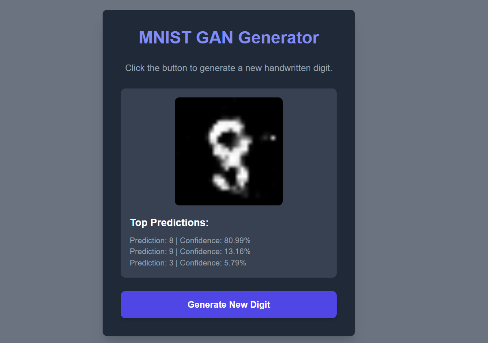

# MNIST GAN with FastAPI and HTML UI

This project implements a Generative Adversarial Network (GAN) to generate handwritten digits, which are then served through a web application built with FastAPI and a custom HTML front-end. The project is designed for reproducibility and demonstrates a complete MLOps workflow, from model training to application deployment.

## Project Overview



The core of this project consists of:

* A **Generator model** trained on the MNIST dataset to create new handwritten digits.
* A **Classifier model** that predicts the digit and confidence level of the generated image.
* A **FastAPI server** that exposes a `/generate_image` endpoint to serve these new images and their predictions.
* A simple **HTML front-end** that allows users to interact with the model and view the generated digits and their predictions in real-time.

The project is structured to separate the model training pipeline from the web application, making it easy to manage and deploy.

## Folder Structure

```
.
├── app/                     # Main application code
│   ├── main.py              # FastAPI endpoint to generate images
│   └── templates/           # HTML templates for the UI
│       └── index.html
├── model/                   # Trained model files
│   ├── generator_model.pth  # The saved Generator model
│   └── classifier_model.pth # The saved Classifier model
├── logs/                    # Training logs and other run artifacts
├── tests/                   # Application test cases
│   └── test_app.py
├── .github/                 # GitHub Actions CI pipeline
│   └── workflows/
│       └── ci.yml
├── requirements.txt         # Python dependencies
├── README.md                # Project documentation
├── prepare_model.py         # Script to train and save the GAN model
└── prepare_classifier.py    # Script to train and save the Classifier model
```

## Setup and Installation

### Prerequisites

* Python 3.8+
* A CUDA-enabled GPU (optional, but recommended)

### Local Environment Setup

1. **Clone the repository and navigate into it:**
   ```
   git clone [https://github.com/your_username/mnist-gan-fastapi.git](https://github.com/your_username/mnist-gan-fastapi.git)
   cd mnist-gan-fastapi
   ```
2. **Activate your virtual environment:**
   ```
   source venv/bin/activate
   ```
3. **Install dependencies:**
   ```
   pip install -r requirements.txt
   ```
4. **Prepare the models:** Run the training scripts to generate and save your model files.
   ```
   python prepare_model.py
   python prepare_classifier.py
   ```

## Running the Application

To run the FastAPI application, use the `uvicorn` server.

```
python -m uvicorn app.main:app --reload
```

> **Note on Local Access:** The server will run on `http://0.0.0.0:8000`, which means it is listening on all network interfaces. To access it from your web browser, you must use the local address: `http://127.0.0.1:8000`.

## Testing & CI/CD Pipeline

The project includes a CI pipeline with unit tests for the application.

### Running Local Tests
To run the tests on your local machine, use `pytest`. This command will verify that your FastAPI endpoints are working correctly.
```
pytest tests/
```

### GitHub Actions CI
A GitHub Actions pipeline is configured to run tests on the FastAPI application every time code is pushed. This ensures the application remains functional and correctly configured. The pipeline will:
* Install dependencies.
* Run the tests on the FastAPI endpoints.

This continuous integration process ensures that your application is always ready for deployment.

### Docker Deployment
The project is containerized to ensure a consistent, reproducible environment. A `Dockerfile` is included to build a production-ready image of the application.

```bash
# Build the Docker image
docker build -t mnist-gan-fastapi:latest .

# Run the container with GPU support and exposed port
docker run --gpus all --shm-size=2g -p 8000:8000 mnist-gan-fastapi:latest